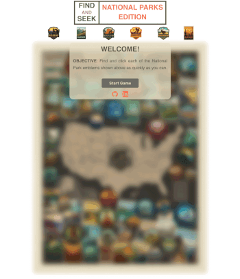

# find and seek - national parks edition

this is the [fourth react project](https://www.theodinproject.com/paths/full-stack-javascript/courses/javascript/lessons/where-s-waldo-a-photo-tagging-app) from the odin project's full stack javascript curriculum.

## live version

[click here](https://jernestmyers.github.io/photo-tag-game/) for a live version!

## project objectives

1. use react with a firebase backend to build a photo-tagging game reminiscent of a "where's waldo" puzzle.
2. leverage firebase's firestore NoSQL cloud storage to validate targets and to maintain a leaderboard.

## technologies used

 

 

## app features

1. uses [this collage of the national parks](https://www.andersondesigngroupstore.com/a/collections/61-american-national-parks/63-image-national-parks-collage-map/1861959974961) and asks users to find and click on six park emblems within it.
2. the backend stores the targets' location data relative to the national park collage thereby allowing the game to be both responsive to any changes made to the screen size during gameplay and easily scalable.
3. validates target locations dynamically by coupling the backend's relative location data of the targets with the frontend's absolute positioning data of the national park collage.
4. a leaderboard is stored on the backend and is fetched during gameplay. the leaderboard is rendered conditionally based on whether or not the user scored in the top 5. irrespective, the user's score and rank are displayed on the leaderboard.
5. user may choose to add their name to the leaderboard which will set their data to firestore, the backend.
6. leaderboard and user rankings are processed through a function that uses indices to return an ordinal string, thus allowing for ordinal rankings like 1st, 2nd, 3rd ... and so on.
7. imports the [date-fns](https://date-fns.org/) library to calculate the user's game duration. uses the differenceInMilliseconds function to calculate the difference between two Date objects, timeOfStart and timeOfEnd.
8. the pointer and the target list dynamically respond to a user's click to ensure neither are rendered outside of the national park collage.
9. feedback is given to the user when targets are correctly or incorrectly located. further, targets are both blurred from the key and removed from the target list when found.

## areas for improvement

1. improve responsiveness across browsers and devices.
